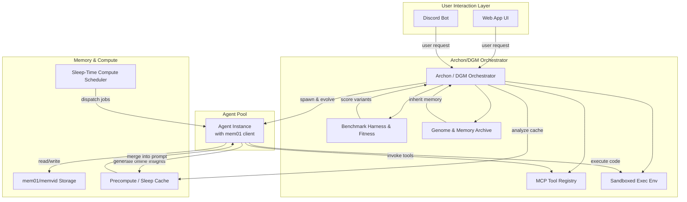

Here’s a Mermaid flowchart capturing the end-to-end orchestration of the Omni Agent project, with all major components and their interactions:

**Legend / Notes**

- **Web App UI / Discord Bot**: Front-end entry points for human users.
    
- **Archon / DGM Orchestrator**: Central controller that spawns, mutates, evaluates, and selects agents based on fitness functions and lineage.
    
- **MCP Tool Registry**: Dynamic catalog of available tool‐endpoints agents can discover and call at runtime.
    
- **Sandboxed Exec Env**: Isolated runtime (e.g., Docker/K8s) for agents’ code execution and new tool scaffolding.
    
- **Benchmark Harness & Fitness**: Automated suite for evaluating agent variants on coding, reasoning, or domain-specific tasks.
    
- **Genome & Memory Archive**: Versioned store of agent “genomes” (models, prompts, tool sets) and high-value memory shards for hereditary inheritance.
    
- **Agent Instance**: LLM-driven “subagent” with mem01 client extensions for memory lookup (`search_memory`, `stream_memory`) and MCP tool invocation.
    
- **mem01/memvid Storage**: Video+JSON memory store providing fast retrieval and tombstone editing functions.
    
- **Sleep-Time Compute Scheduler**: Dispatches idle-time jobs to agents for offline chain-of-thought, summarization, and precompute.
    
- **Precompute / Sleep Cache**: Stores embeddings, extracted facts, and summaries to be merged into live prompts for faster, richer responses.